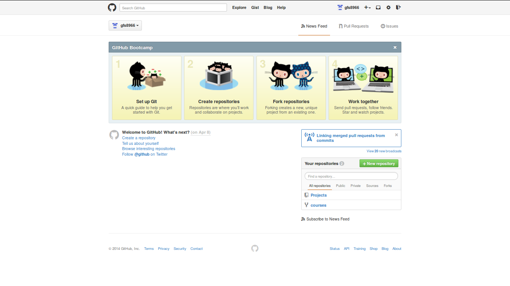

## Future Topics
* Importing and cleaning data
* Graphing
  + working beyond base plotting
  + interactive plots...???
* Writing custom functions
  + if you plan to do it more than once, write it as a function!
  + keeps code concise and minimizes errors
* Loops and Apply functions
  + let computers do repetitive things
* Possibly some stats...
* What are you interested in learning?

---
## Cycle of data anlaysis
1. Collect raw data
2. Look at it
  + summarize
  + plot ...
3. Clean
4. Analyze
5. Find error - return to #2  
  
Repeating Step 2-5 should take a minimal amount of time with good coding/organizational structure!

But HOW?

---
## Reproducible Research
### Given the same raw data and code, final outputs should be identical
* R not only does the analysis, it records what you did!
* Important for __future YOU__ and others interested in what you did
* File structure becomes important!

```{r eval=FALSE}
mydata <- read.csv("~/Data/my_raw_data.csv")
```

### Avoid
* use of `file.choose()` function
* manually editing data in {cough} Excel

---
## Some important principles

1.  Work in a project directory
  - all code inputs/outputs can then have 'relative' locations and are shareable
  - `read.csv('/MyProject/Data/mydata.csv')`
  - `pdf('/MyProject/Figures/myboxplot.pdf')`
2. Raw data is 'read-only'
3. Clean/sort/subset data in a script ("MAKE" file)
  -  use comments or better yet a markdown format to record decisions
4. Use specific variable conditions not relative terms
 - use: `mydata<-mydata[,c("AGE", "FLEN")]`
 - not: `mydata<-mydata[,c(1,3)]`
5. Be aware of randomization processes...

---
## Git & Github
### Git is a version control system... 
### think of it as an unlimited 'undo' button.
### It is NOT a back up system!

A way to share, collaborate and track changes in documents and code.  
Keep track of when, why and how you did something.



---
## What's the difference?
### Git
  - Locally on your computer
  - Can either be run in a GUI or by command line
  - Tracks changes within folders and files

### Github
  - Mode of sharing and collaborating

---
## 5 Simple commands
1. cd
  -`cd MyProject`
2. add
  - `git add -A`
3. status
  - `git status`
4. commit
  -`git commit -m "I made an important change"`
5. push
  -`git push`
  
There's more... just type `git` then {enter}

---
## Rstudio
### It can be just your consol and editor, but it has the potential to be SO much more.

* Integration of code, results and documents
  + presentations and papers are auto updating!
* Good way to keep track of ideas (good and bad) alongside code and results
* Includes a GUI for git
* Quick access to help files

--- &twocol
## Markdown and knitr
Two packages that allow you to do cool stuff with RStudio
*** =left
### Markdown
 - produces html document
 - simple language
 - good for keeping track of works in progress
 
*** =right
### knitr
 - integrates R code in to Latex documents (saved as pdf)
 - produces print ready document
 - focus on content, let fomatting take care of itself
 - ability to generate batch reports

---
## Using R
- Assumption is that you have been using R for various undergrad assignments.  
- Focus will be on advancing your understanding and writing better code
```{r}
a <- c(1:10)
a
b <- a * 2
# what is b going to look like?
```

--- 
## Vectorized Operations
```{r}
b
```

This is a trivial example but becomes important as the computations become more complex.
### Example
```{r}
catch <- data.frame(lakeA=c(10,5,2), lakeB=c(15,2,3))
rownames(catch) <-c('perch', 'walleye', 'bass')
effort <- data.frame(lakeA=c(2,2,2), lakeB=c(3,3,3))
```

---
## Calculating CUE
```{r}
catch
effort
CUE <- catch/effort 
```

---
## CUE Table
```{r}
CUE
```
Or a little more nicely presented...
```{r, echo=FALSE, results='asis'}
cueTable<-xtable::xtable(CUE)
print(cueTable, type='html')
```

---
## Reproducible Examples
In order to test your code, start with a trivial example on an easy to check example.
```{r, echo=TRUE}
ColA <- rep(c('A','B','C'), 5)
set.seed(1234)
ColB<-round(runif(15, min=0, max=100),0)
mydf<-data.frame(ColA,ColB)
aggregate(ColB~ColA, data=mydf, FUN=mean)
```

---
## How We'll Work
- I'll generally prepare a short lecture
- An 'in class' problem to demonstrate a concept
- A 'homework' assignment to extend your understanding
- BYOP - Bring your own problem
