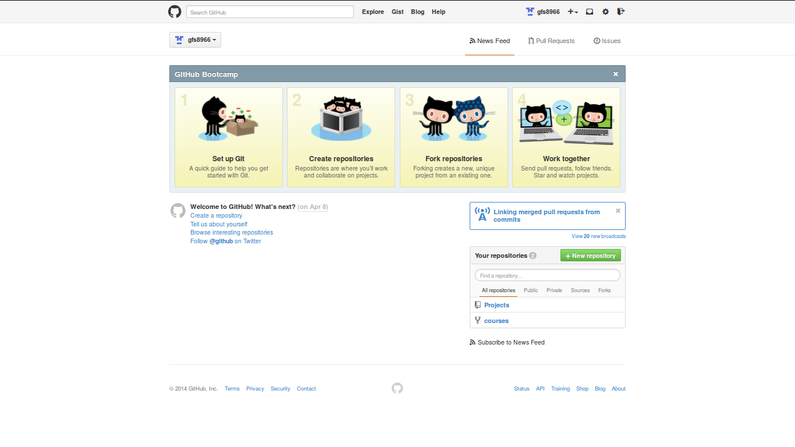

## Overview
### Why learn programming?  
Being able to efficeintly manage and manipulate data allows you to inspect the data for errors, anomalies and interesting questions.  Once you know the right question to ask, the analysis of data is just stats/math.  

### Overall Learning Objectives:
- Develop programming skills
- Efficient use of code
- Reproducible research
- Integrate code and documentation

--- 

## Introduction
Lots of good reasons to use R...
- Open source
- Rapid development of new packages and tools
- Programming lets computers do the repetitive work leaving time for people to do stuff that computers can't, like asking good research questions.

--- 
## Week 1
1. Concepts of **Reproducible Research**
2. Introduce additional tools
3. Review general R concepts


---
## Future Topics
* Importing and cleaning data
* Graphing
  + working beyond base plotting
  + interactive plots...???
* Writing custom functions
  + if you plan to do it more than once, write it as a function!
  + keeps code concise and minimizes errors
* Loops and Apply functions
  + let computers do repetitive things
* Possibly some stats...
* What are you interested in learning?

---
## Cycle of data anlaysis
1. Collect raw data
2. Look at it
  + summarize
  + plot ...
3. Clean
4. Analyze
5. Find error - return to #2  
  
Repeating Step 2-5 should take a minimal amount of time with good coding/organizational structure!

But HOW?

---
## Reproducible Research
### Given the same raw data and code, final outputs should be identical
* R not only does the analysis, it records what you did!
* Important for __future YOU__ and others interested in what you did
* File structure becomes important!


```r
mydata <- read.csv("~/Data/my_raw_data.csv")
```

### Avoid
* use of `file.choose()` function
* manually editing data in {cough} Excel

---
## Some important principles

1.  Work in a project directory
  - all code inputs/outputs can then have 'relative' locations and are shareable
  - `read.csv('/MyProject/Data/mydata.csv')`
  - `pdf('/MyProject/Figures/myboxplot.pdf')`
2. Raw data is 'read-only'
3. Clean/sort/subset data in a script ("MAKE" file)
  -  use comments or better yet a markdown format to record decisions
4. Use specific variable conditions not relative terms
 - use: `mydata<-mydata[,c("AGE", "FLEN")]`
 - not: `mydata<-mydata[,c(1,3)]`
5. Be aware of randomization processes...

---
## Git & Github
### Git is a version control system... 
### think of it as an unlimited 'undo' button.
### It is NOT a back up system!

A way to share, collaborate and track changes in documents and code.  
Keep track of when, why and how you did something.



---
## What's the difference?
### Git
  - Locally on your computer
  - Can either be run in a GUI or by command line
  - Tracks changes within folders and files

### Github
  - Mode of sharing and collaborating

---
## 5 Simple commands
1. cd
  -`cd MyProject`
2. add
  - `git add -A`
3. status
  - `git status`
4. commit
  -`git commit -m "I made an important change"`
5. push
  -`git push`
  
There's more... just type `git` then {enter}

---
## Rstudio
### It can be just your consol and editor, but it has the potential to be SO much more.

* Integration of code, results and documents
  + presentations and papers are auto updating!
* Good way to keep track of ideas (good and bad) alongside code and results
* Includes a GUI for git
* Quick access to help files

--- &twocol
## Markdown and knitr
Two packages that allow you to do cool stuff with RStudio
*** =left
### Markdown
 - produces html document
 - simple language
 - good for keeping track of works in progress
 
*** =right
### knitr
 - integrates R code in to Latex documents (saved as pdf)
 - produces print ready document
 - focus on content, let fomatting take care of itself
 - ability to generate batch reports

---
## Using R
- Assumption is that you have been using R for various undergrad assignments.  
- Focus will be on advancing your understanding and writing better code

```r
a <- c(1:10)
a
```

```
##  [1]  1  2  3  4  5  6  7  8  9 10
```

```r
b <- a * 2
# what is b going to look like?
```

--- 
## Vectorized Operations

```r
b
```

```
##  [1]  2  4  6  8 10 12 14 16 18 20
```

This is a trivial example but becomes important as the computations become more complex.
### Example

```r
catch <- data.frame(lakeA=c(10,5,2), lakeB=c(15,2,3))
rownames(catch) <-c('perch', 'walleye', 'bass')
effort <- data.frame(lakeA=c(2,2,2), lakeB=c(3,3,3))
```

---
## Calculating CUE

```r
catch
```

```
##         lakeA lakeB
## perch      10    15
## walleye     5     2
## bass        2     3
```

```r
effort
```

```
##   lakeA lakeB
## 1     2     3
## 2     2     3
## 3     2     3
```

```r
CUE <- catch/effort 
```

---
## CUE Table

```r
CUE
```

```
##         lakeA  lakeB
## perch     5.0 5.0000
## walleye   2.5 0.6667
## bass      1.0 1.0000
```
Or a little more nicely presented...
<!-- html table generated in R 3.1.1 by xtable 1.7-4 package -->
<!-- Sun Oct 19 18:14:08 2014 -->
<table border=1>
<tr> <th>  </th> <th> lakeA </th> <th> lakeB </th>  </tr>
  <tr> <td align="right"> perch </td> <td align="right"> 5.00 </td> <td align="right"> 5.00 </td> </tr>
  <tr> <td align="right"> walleye </td> <td align="right"> 2.50 </td> <td align="right"> 0.67 </td> </tr>
  <tr> <td align="right"> bass </td> <td align="right"> 1.00 </td> <td align="right"> 1.00 </td> </tr>
   </table>

---
## Reproducible Examples
In order to test your code, start with a trivial example on an easy to check example.

```r
ColA <- rep(c('A','B','C'), 5)
set.seed(1234)
ColB<-round(runif(15, min=0, max=100),0)
mydf<-data.frame(ColA,ColB)
aggregate(ColB~ColA, data=mydf, FUN=mean)
```

```
##   ColA ColB
## 1    A 30.6
## 2    B 66.4
## 3    C 55.0
```

--- &twocol
## A note on data organization...
+ Will be times need to rethink how to organize data from how you may have learned in the past
*** =left
Excel style...
<!-- html table generated in R 3.1.1 by xtable 1.7-4 package -->
<!-- Sun Oct 19 18:24:15 2014 -->
<table border=1>
<tr> <th>  </th> <th> a </th> <th> b </th>  </tr>
  <tr> <td align="right"> 1 </td> <td align="right">   1 </td> <td align="right">   6 </td> </tr>
  <tr> <td align="right"> 2 </td> <td align="right">   2 </td> <td align="right">   7 </td> </tr>
  <tr> <td align="right"> 3 </td> <td align="right">   3 </td> <td align="right">   8 </td> </tr>
  <tr> <td align="right"> 4 </td> <td align="right">   4 </td> <td align="right">   9 </td> </tr>
  <tr> <td align="right"> 5 </td> <td align="right">   5 </td> <td align="right">  10 </td> </tr>
   </table>

*** =right
Compared to...
<!-- html table generated in R 3.1.1 by xtable 1.7-4 package -->
<!-- Sun Oct 19 18:24:15 2014 -->
<table border=1>
<tr> <th>  </th> <th> Level </th> <th> Value </th>  </tr>
  <tr> <td align="right"> 1 </td> <td> a </td> <td align="right">   1 </td> </tr>
  <tr> <td align="right"> 2 </td> <td> a </td> <td align="right">   2 </td> </tr>
  <tr> <td align="right"> 3 </td> <td> a </td> <td align="right">   3 </td> </tr>
  <tr> <td align="right"> 4 </td> <td> a </td> <td align="right">   4 </td> </tr>
  <tr> <td align="right"> 5 </td> <td> a </td> <td align="right">   5 </td> </tr>
  <tr> <td align="right"> 6 </td> <td> b </td> <td align="right">   6 </td> </tr>
  <tr> <td align="right"> 7 </td> <td> b </td> <td align="right">   7 </td> </tr>
  <tr> <td align="right"> 8 </td> <td> b </td> <td align="right">   8 </td> </tr>
  <tr> <td align="right"> 9 </td> <td> b </td> <td align="right">   9 </td> </tr>
  <tr> <td align="right"> 10 </td> <td> b </td> <td align="right">  10 </td> </tr>
   </table>


---
## How We'll Work
- I'll generally prepare a short lecture
- An 'in class' problem to demonstrate a concept
- A 'homework' assignment to extend your understanding
- BYOP - Bring your own problem
